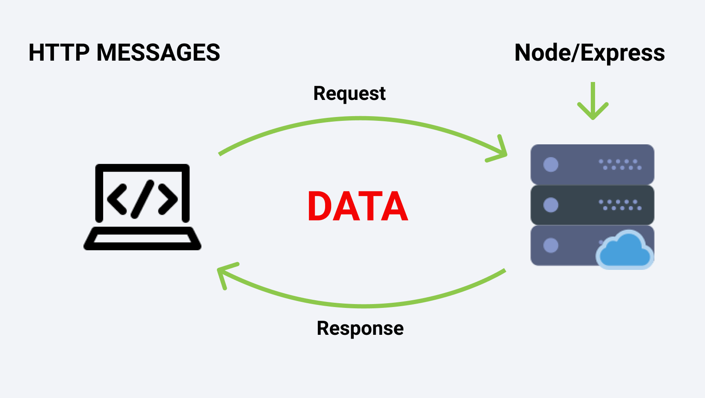
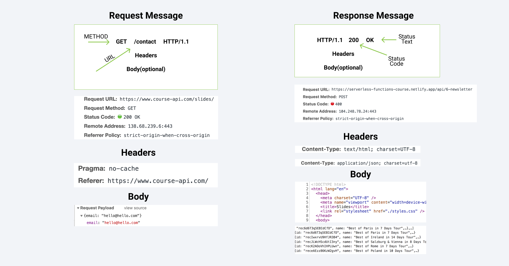
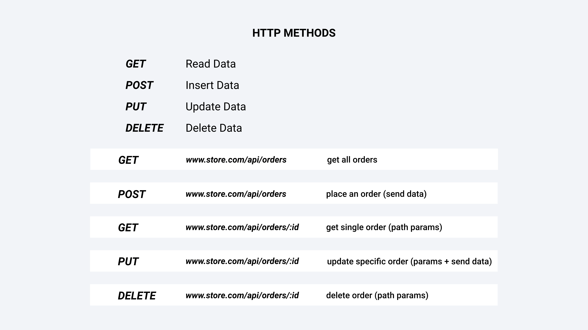

# Web data exchanging

## Request and resonse

Everytime we type URL, it is a web `request` to the SERVER that holds said resources. That server will send you back the `response`.

Note:
- Not HTTP protocol, just HTTP message)
- We use Node and Express (a framework for NodeJS)
- In the end, the servers are just computers that work to serve 24/7

## How HTTP messages are structured?

Structures are similar
1. Both have a start line
2. Both have optional header
3. A blank line to show that the meta-data (header) has been sent.
4. Optional body (payload)

Note:
1. Request messages are what the users are sending
2. Responses messages are the dev responsibility
3. Thus, we must make sure to send a correct response.

### Request Message
In the start line there will be:
1. A method - Communicating on what we want
2. A url
3. HTTP version

Note:
1. GET is the default method (we mostly want to just get the content for display)

### Response Message
Start line:
1. HTTP version
2. Status Code (Result of the request) 
    - 200 = Request is successful
    - 400 = Request Error
    - 401 = Unauthorize Request
    - 404 = Resource not found
    - etc.
3. Status Text

Header:
1. Content Type (What we're responding with):
    - text/html; (Sending back HTML file)
    - application/json; (Sending back data)